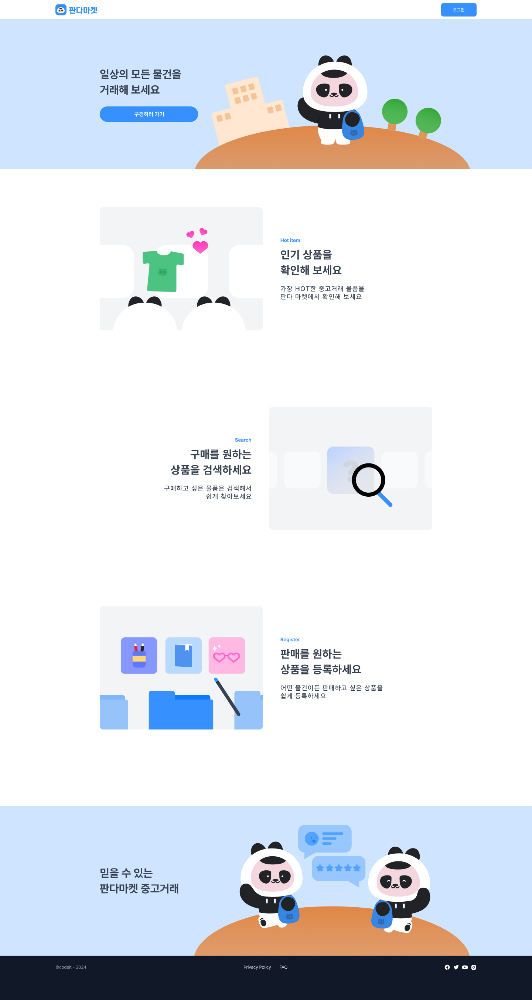

<!-- # Frontend Mentor - QR code component solution -->

<!--
This is a solution to the [QR code component challenge on Frontend Mentor](https://www.frontendmentor.io/challenges/qr-code-component-iux_sIO_H). Frontend Mentor challenges help you improve your coding skills by building realistic projects.

---

사용 전 지우기

--- -->

# 코드잇 스프린트 6기 프로젝트



## 목차

- [코드잇 스프린트 6기 프로젝트](#코드잇-스프린트-6기-프로젝트)
  - [목차](#목차)
  - [개요](#개요)
    - [페이지 스크린샷](#페이지-스크린샷)
    - [링크](#링크)
  - [내작업](#내작업)
    - [사용한것](#사용한것)
    - [배운점](#배운점)
    - [향후분야](#향후분야)
  - [작성자](#작성자)
  - [참고](#참고)

## 개요

### 페이지 스크린샷

### 링크

## 내작업

### 사용한것

- Semantic HTML5 markup
- CSS

<!--
- CSS custom properties
- Flexbox
- Mobile-first workflow
- [React](https://reactjs.org/) - JS library
- [Next.js](https://nextjs.org/) - React framework
- [Styled Components](https://styled-components.com/) - For styles

**Note: These are just examples. Delete this note and replace the list above with your own choices** -->

### 배운점

<!--
Use this section to recap over some of your major learnings while working through this project. Writing these out and providing code samples of areas you want to highlight is a great way to reinforce your own knowledge.

To see how you can add code snippets, see below:

```html
<h1>Some HTML code I'm proud of</h1>
```

```css
.proud-of-this-css {
  color: papayawhip;
}
```

```js
const proudOfThisFunc = () => {
  console.log("🎉");
};
```

If you want more help with writing markdown, we'd recommend checking out [The Markdown Guide](https://www.markdownguide.org/) to learn more.

**Note: Delete this note and the content within this section and replace with your own learnings.** -->

### 향후분야

<!--
Use this section to outline areas that you want to continue focusing on in future projects. These could be concepts you're still not completely comfortable with or techniques you found useful that you want to refine and perfect.

**Note: Delete this note and the content within this section and replace with your own plans for continued development.** -->

## 작성자

<!--
- Website - [Add your name here](https://www.your-site.com)
- Frontend Mentor - [@yourusername](https://www.frontendmentor.io/profile/yourusername)
- Twitter - [@yourusername](https://www.twitter.com/yourusername)

**Note: Delete this note and add/remove/edit lines above based on what links you'd like to share.** -->

## 참고

<!--
This is where you can give a hat tip to anyone who helped you out on this project. Perhaps you worked in a team or got some inspiration from someone else's solution. This is the perfect place to give them some credit.

**Note: Delete this note and edit this section's content as necessary. If you completed this challenge by yourself, feel free to delete this section entirely.** -->
